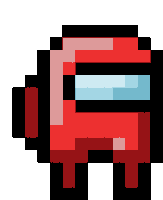

# 3D Game Development with Three.js

  

## 3D Game Development with Three.js

This project is a 3D computer game created using the Three.js graphics framework. It consists of three levels/stages that can be played in a web browser, specifically Chrome on Ubuntu. The game showcases various technical aspects of graphics, including hierarchical modeling, camera and lighting systems, and materials. While meeting these fundamental requirements, the project also emphasizes design, polish, and innovation, allowing for creative game development beyond the default capabilities of HTML and Three.js.

For more information about Three.js, please visit the [Three.js Official Website](https://threejs.org/editor/). Refer to their "Getting Started" and "Examples" pages for assistance. This project leverages Three.js's scenegraph API, enabling the loading and creation of 3D models, integration of physics engines, and management of lights and cameras. It's crucial to carefully consider the hierarchy of objects within the game world for both design sensibility and motivation.

### Contributors

| Name               | GitHub Username     |
|--------------------|---------------------|
| Nyiko Mthombeni      | [Ndzxlo](https://github.com/ndzxlo) |
| Nduduzo Shoba      | [PhilaOfStrength](https://github.com/PhilaOfStrength) |
| Sibusiso Mfana      | [ItsJustSbu](https://github.com/ItsJustSbu) |
| Faith Mokgalaka     | [Khatji](https://github.com/Khatji) |
| Vance Muchongo      | [Mr-Vance](https://github.com/mr-vance) |

This project will undergo three stages:
- **Alpha**: A preliminary implementation and discussion plans.
- **Beta**: An assessment of the project's progress, including a demo and discussion of design choices.
- **Final Release**: The final project, including a detailed analysis of design decisions and presentation.

## Schedule
- Alpha version due on Tuesday, September 12th, 2023.
- Beta version due on the week of October 3rd, 2023.
- Final project due on the week of October 24th, 2023.

Various online resources, such as Google, YouTube, OpenCourseWare, and StackOverflow, to support the project development were used.
